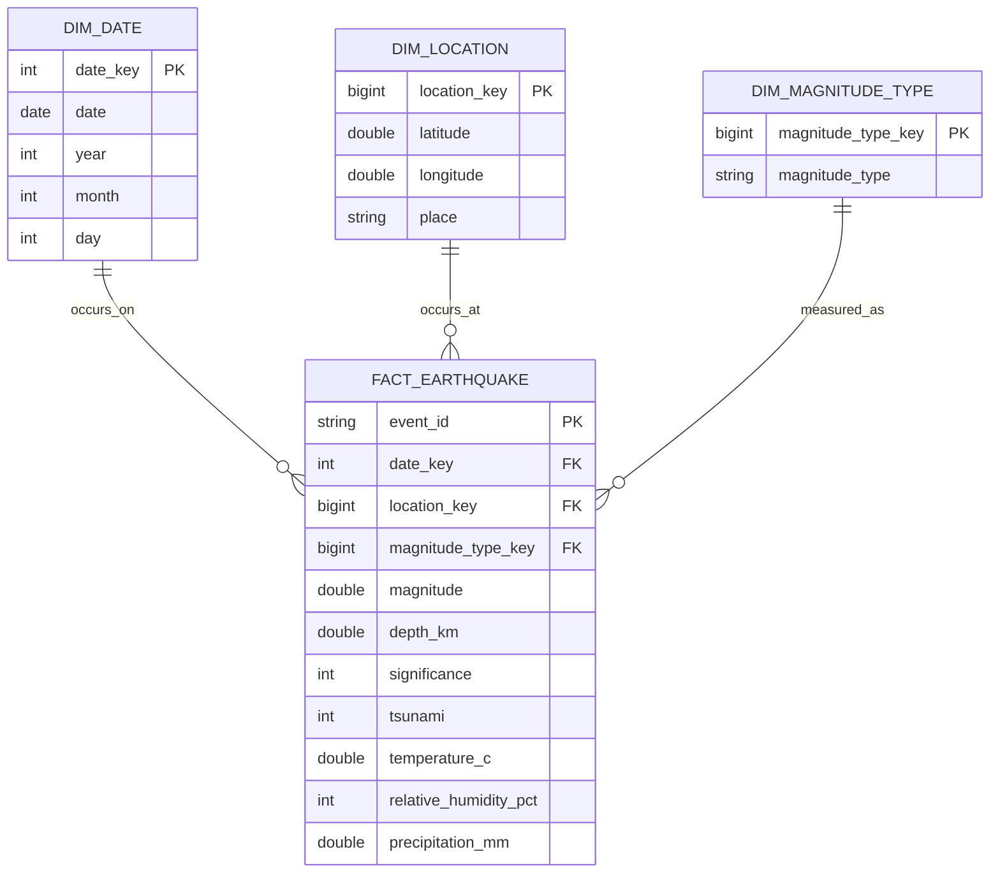

# Gold star schema

```mermaid
erDiagram
  DIM_DATE ||--o{ FACT_EARTHQUAKE : occurs_on
  DIM_LOCATION ||--o{ FACT_EARTHQUAKE : occurs_at
  DIM_MAGNITUDE_TYPE ||--o{ FACT_EARTHQUAKE : measured_as
  DIM_DATE {
    int date_key PK
    date date
    int year
    int month
    int day
  }
  DIM_LOCATION {
    bigint location_key PK
    double latitude
    double longitude
    string place
  }
  DIM_MAGNITUDE_TYPE {
    bigint magnitude_type_key PK
    string magnitude_type
  }
  FACT_EARTHQUAKE {
    string event_id PK
    int date_key FK
    bigint location_key FK
    bigint magnitude_type_key FK
    double magnitude
    double depth_km
    int significance
    int tsunami
    double temperature_c
    int relative_humidity_pct
    double precipitation_mm
  }
```

Grain: one row per USGS event ID. Weather fields represent the latest fetched snapshot available for that event.
